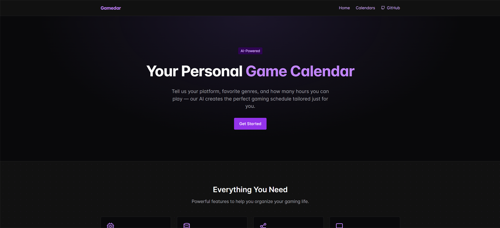
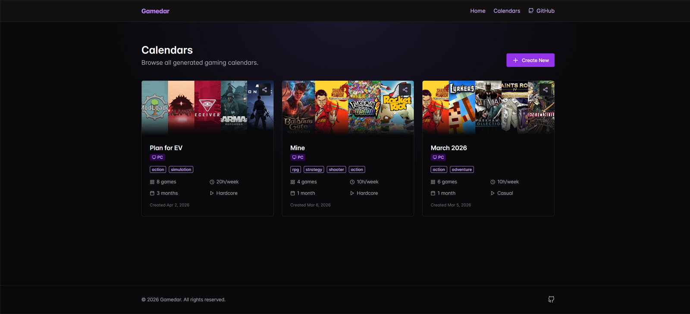
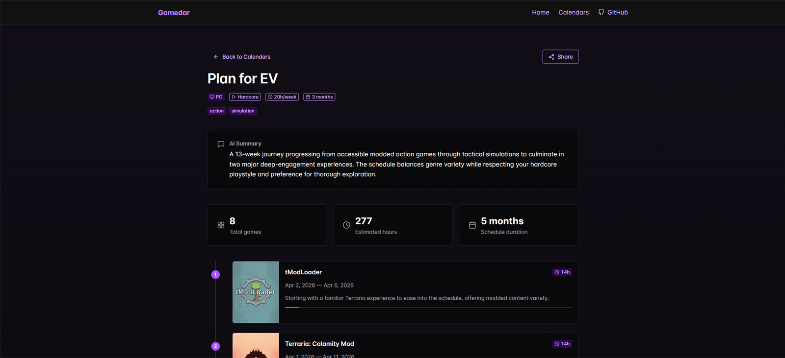

# Gamedar

**AI-powered game calendar generator.** Pick your platform, favorite genres, and weekly hours — Claude builds you a personalized gaming schedule from real IGDB game data.

**Live demo → [gamedar.gapchix.io](https://gamedar.gapchix.io)** · **Build log → [How I built Gamedar](https://gapchix.io/blog/building-gamedar-ai-game-calendar)**

[](https://github.com/gapchix/gamedar/actions/workflows/ci.yml)
[](LICENSE)
[](https://nextjs.org)
[](https://platform.claude.com)



## How it works

1. **You choose** — platform (PC / PlayStation / Xbox / Switch), genres, hours per week, play style (casual / balanced / hardcore), and a time period.
2. **IGDB search** — Gamedar queries the [IGDB API](https://www.igdb.com/api) for well-rated games matching your platform and genres, including time-to-beat data.
3. **Claude schedules** — the Claude API turns the game list and your time budget into a non-overlapping schedule: which games, in what order, with start/end dates and a reason for each pick. The response is validated against a Zod schema before anything is stored.
4. **Share it** — every calendar gets a public page with cover art, a timeline, and an AI summary.

| Browse calendars                                 | Calendar view                                        |
| ------------------------------------------------ | ---------------------------------------------------- |
|  |  |

## Tech Stack

- **Next.js 16** (App Router, TypeScript strict) + **Chakra UI v3**
- **react-hook-form + Zod** — one schema validates the form, the API route, and the server action
- **Prisma v7 + PostgreSQL** (`@prisma/adapter-pg`, driver adapters)
- **Claude API** via `@anthropic-ai/sdk` — AI scheduling
- **IGDB API** (Twitch OAuth) via axios — game data + time-to-beat
- **Docker Compose** — dev database and production deployment

## Getting Started

### Prerequisites

- Node.js 20+
- Docker & Docker Compose
- [IGDB (Twitch) credentials](https://api-docs.igdb.com/#getting-started) and an [Anthropic API key](https://platform.claude.com/)

### Setup

```bash
# Install dependencies
npm install

# Copy env file and fill in your keys:
#   DATABASE_URL           - PostgreSQL connection string
#   POSTGRES_PASSWORD      - Docker Compose DB password (required, no default)
#   IGDB_CLIENT_ID         - From Twitch Developer Console
#   IGDB_CLIENT_SECRET     - From Twitch Developer Console
#   ANTHROPIC_API_KEY      - From Anthropic Console
#   ANTHROPIC_MODEL        - Claude model ID (e.g. claude-sonnet-5)
#   DAILY_GENERATION_LIMIT - Max calendars per day, global (default: 5)
cp .env.example .env

# Start PostgreSQL via Docker (exposed on port 5532)
docker compose --profile dev up -d

# Run migrations (also generates the Prisma client)
npx prisma migrate dev

# Start dev server
npm run dev
```

Open [http://localhost:3000](http://localhost:3000).

### Production Deployment

```bash
cp .env.example .env
# Edit .env: set DATABASE_URL=postgresql://user:pass@db:5432/gamedar,
# fill in API keys, set NEXT_PUBLIC_APP_URL to your domain

make prod-build
make prod-up
```

The app binds to `localhost:3001` — put Nginx (or any reverse proxy) in front of it. PostgreSQL stays internal to the Docker network (no host port).

```bash
make prod-logs            # View logs
make prod-down            # Stop everything
make prod-migrate         # Run migrations
```

## Scripts

| Command             | Description                    |
| ------------------- | ------------------------------ |
| `make dev-db`       | Start dev database (port 5532) |
| `make dev`          | Start dev server               |
| `make migrate`      | Run Prisma migrations (dev)    |
| `make generate`     | Regenerate Prisma client       |
| `make prod-build`   | Build production Docker image  |
| `make prod-up`      | Start production containers    |
| `make prod-down`    | Stop production containers     |
| `make prod-logs`    | Tail production logs           |
| `npm run lint`      | Run ESLint                     |
| `npm run format`    | Format all files with Prettier |
| `npm run igdb-sync` | Check IGDB mappings for drift  |

## Project Structure

```
src/
├── app/              # Routes and layouts
│   ├── page.tsx      # Homepage
│   ├── icon.svg      # Favicon
│   ├── calendars/    # /calendars, /calendars/add, /calendars/:id
│   └── api/          # REST endpoints (POST/GET /api/calendars)
├── proxy.ts          # Per-IP rate limiting for API routes
├── components/       # Shared UI (header, footer, calendar-form, calendar-list, calendar-view, ...)
├── lib/              # Prisma, IGDB client, Anthropic client, shared calendar-creation flow
│   ├── create-calendar.ts   # One flow used by both the API route and the server action
│   ├── generation-limit.ts  # Atomic daily generation cap (DB counter)
│   └── rate-limit.ts        # Fixed-window per-IP limiter
├── types/            # Zod schemas + IGDB ID mappings
└── utils/            # Utility functions
prisma/
└── schema.prisma     # Calendar, CalendarGame, DailyUsage models
```

## Abuse guardrails

Public site, paid APIs behind it — so generation is guarded in layers:

- **Global daily cap** (`DAILY_GENERATION_LIMIT`) reserved atomically in Postgres before any IGDB/Claude call — concurrent requests can't race past the limit, and failed generations return their slot.
- **Per-IP rate limits** — 30 req/min on `/api/*` (proxy) plus a tighter 5 req/min on the generation form path.
- **Prompt-injection isolation** — the only user-controlled free-text field is delimited as data in the Claude prompt, and the model's output is length-capped and schema-validated.
- **Input validation** — Zod schemas with enum constraints and max lengths; 10 KB request body limit; timeouts on all external calls (IGDB 15s, Claude 120s).
- Security headers (X-Frame-Options, nosniff, Referrer-Policy, Permissions-Policy); no secrets in code.

## The `/igdb-sync` skill

Game categories in the app map to hand-maintained IGDB genre/theme/platform IDs, and IGDB's taxonomy moves. [`.claude/skills/igdb-sync`](.claude/skills/igdb-sync/SKILL.md) is a [Claude Code](https://claude.com/claude-code) skill that detects two failure modes before users see them:

- **Coverage** — every app enum value has an IGDB mapping (an unmapped genre silently returns zero games)
- **Drift** — every mapped ID still exists upstream and its live name still matches the app label

Run it standalone with `npm run igdb-sync` (add `--offline` to skip the live check).

## CI

GitHub Actions runs ESLint, Prettier, and a production build on every push and PR to `main` and `dev`.

## License

[MIT](LICENSE)
